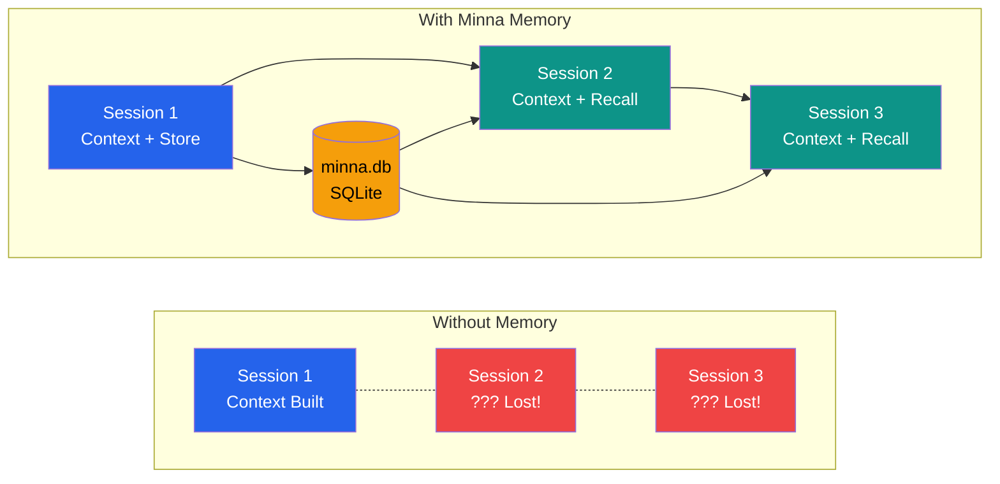

# Minna Memory

Cross-session persistence for AI agents.

---

## The Session Continuity Problem



---

## Entity-Attribute-Value Model

| ENTITY (what) | ATTRIBUTE (aspect) | VALUE (data) |
|---|---|---|
| `8me` | `purpose` | `Loop toolkit` |
| `8me` | `tier1_status` | `COMPLETE` |
| `user` | `prefers` | `dark mode` |

---

## Basic Usage

```python
from minna_memory import MinnaMemory

memory = MinnaMemory(".spine/minna.db")

# Store memory
memory.store(
    entity="my-project",
    attribute="status",
    value="In development",
    confidence=1.0
)

# Recall memories
memories = memory.recall(entity="my-project")

# Search across all memories
results = memory.search("development")

# Relationships
memory.relate(
    from_entity="user",
    to_entity="my-project",
    rel_type="works_on"
)
```

---

## High Portability

Single SQLite file = complete state:

```
project/
└── .spine/
    └── minna.db    ← Contains ALL memory
```

| Scenario | How Minna Helps |
|----------|-----------------|
| Move to new machine | Copy one SQLite file |
| Share with teammate | Send the .db file |
| Backup/restore | Standard file backup |
| Multi-project | Each project has own .db |

---

## Confidence Decay

Memories decay over time unless verified:

```python
# Initial confidence: 1.0
# After 90 days without verification: ~0.5

memories = memory.recall(
    entity="my-project",
    include_decay=True,
    half_life_days=90
)

# Verify to reset decay
memory.verify(memory_id=123)
```

---

## Use Cases

### Progress Tracking

```python
previous = memory.recall(entity=task.id, attribute="progress")
if previous:
    start_from = previous[0]["value"]  # Resume
```

### Error Pattern Learning

```python
similar = memory.search(error.message)
if similar:
    fix = similar[0]["value"]  # Apply known fix
```

### User Preferences

```python
verbosity = memory.set_preference("output", "verbosity")
```

---

## Best Practices

### DO
- ✅ Store semantic information
- ✅ Use consistent entity names
- ✅ Set appropriate confidence
- ✅ Verify memories that are still accurate

### DON'T
- ❌ Store large binary data
- ❌ Store sensitive credentials
- ❌ Forget to clean up stale memories

---

## Next Steps

- See full documentation in [8me repository](https://github.com/fbratten/8me/tree/main/src/tier3.5-orchestration-concepts)
- Practice: [Lab 12: Memory Integration](../../labs/12-memory)

---

<div style="text-align: center;">
  <a href="../">← Back to Concepts</a>
</div>
