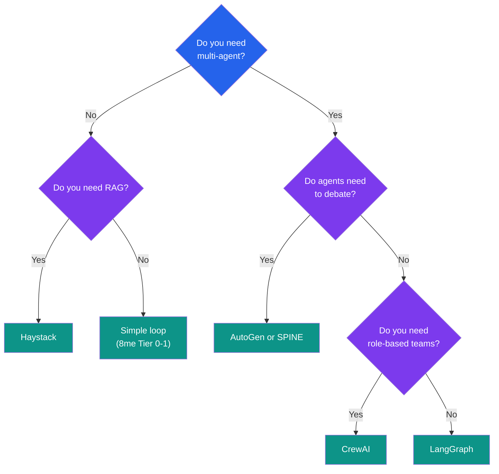

# Provider Overview

Compare LangChain, CrewAI, AutoGen, Semantic Kernel, Haystack, DSPy.

---

## Quick Comparison

| Framework | Focus | Best For | Complexity |
|-----------|-------|----------|------------|
| **LangChain/LangGraph** | Chains & graphs | Complex workflows | High |
| **CrewAI** | Multi-agent teams | Role-based collaboration | Medium |
| **AutoGen (Microsoft)** | Conversational | Agent chat/debate | Medium |
| **Semantic Kernel** | Enterprise | .NET/enterprise integration | High |
| **Haystack** | Pipelines | RAG & search | Medium |
| **DSPy (Stanford)** | Programmatic | Prompt optimization | Medium-High |
| **SPINE** | Context engineering | Claude Code, MCP-native | Low-Medium |

---

## Feature Matrix

| Feature | LangChain | CrewAI | AutoGen | SPINE |
|---------|-----------|--------|---------|-------|
| Multi-Provider | ✅ | ⚠️ Limited | ✅ | ✅ Optimized |
| Self-Play/Debate | ⚠️ Manual | ⚠️ Critic | ✅ Group chat | ✅ DIALECTIC |
| Oscillation Detection | ❌ | ❌ | ❌ | ✅ |
| Context Stacks | ⚠️ Templates | ❌ | ❌ | ✅ 6-layer |
| MCP Native | ❌ | ❌ | ❌ | ✅ |
| Cross-Session Memory | ⚠️ External | ❌ | ⚠️ External | ✅ Minna |

---

## LangChain / LangGraph

**Type:** Chain-based orchestration with graph support

```python
from langchain import LLMChain, PromptTemplate

chain = LLMChain(
    llm=ChatOpenAI(),
    prompt=PromptTemplate.from_template("Answer: {question}")
)
result = chain.run("What is 2+2?")
```

| Pros | Cons |
|------|------|
| Huge ecosystem | Complexity can explode |
| Many integrations | Rapid API changes |
| Good documentation | Abstraction overhead |

---

## CrewAI

**Type:** Multi-agent team orchestration

```python
from crewai import Agent, Task, Crew

researcher = Agent(role="Researcher", goal="Research thoroughly")
writer = Agent(role="Writer", goal="Write clearly")

crew = Crew(
    agents=[researcher, writer],
    tasks=[research_task, write_task],
    process="sequential"
)
result = crew.kickoff()
```

| Pros | Cons |
|------|------|
| Intuitive role model | Less flexible |
| Easy multi-agent | Limited state management |

---

## AutoGen (Microsoft)

**Type:** Conversational multi-agent

```python
from autogen import AssistantAgent, UserProxyAgent

assistant = AssistantAgent(name="assistant", llm_config={...})
user_proxy = UserProxyAgent(name="user_proxy")

user_proxy.initiate_chat(assistant, message="Write fibonacci")
```

| Pros | Cons |
|------|------|
| Natural conversation model | Can be verbose |
| Built-in code execution | Complex for simple tasks |

---

## Decision Tree



---

## The 8me Philosophy

Before reaching for a framework, consider:

1. **Do you need it?** Simple loops solve many problems
2. **Complexity cost**: Frameworks add abstraction overhead
3. **Debugging difficulty**: More layers = harder debugging
4. **Lock-in risk**: Framework APIs change frequently

---

## Next Steps

- Learn about [SPINE Integration](../spine/)
- Explore [Minna Memory](../minna-memory/)

---

<div style="text-align: center;">
  <a href="../">← Back to Concepts</a>
</div>
