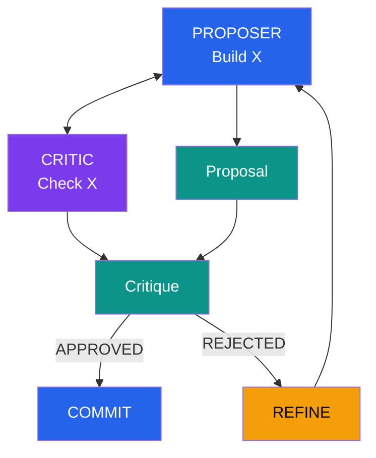
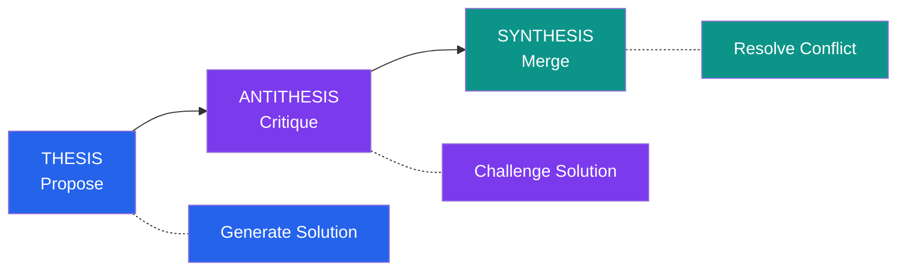
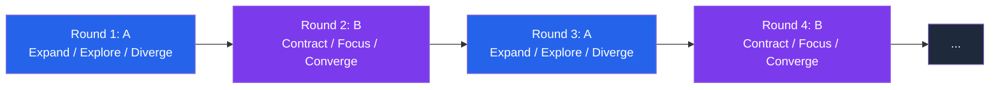

# Self-Play & Oscillation

Internal debate patterns for quality assurance.

---

## Self-Play Pattern

Two "perspectives" debate until convergence:



---

## Implementation

```python
def self_play_orchestration(task, max_rounds=5):
    """
    Internal debate between proposer and critic.
    Converges when critic approves or max rounds reached.
    """
    proposal = None
    history = []

    for round in range(max_rounds):
        # Phase 1: Proposer generates/refines
        if proposal is None:
            proposal = proposer_generate(task)
        else:
            proposal = proposer_refine(task, proposal, critique)

        # Phase 2: Critic evaluates
        critique = critic_evaluate(task, proposal)

        history.append({
            "round": round,
            "proposal": proposal,
            "critique": critique
        })

        # Check for convergence
        if critique.approved:
            return {
                "status": "converged",
                "result": proposal,
                "rounds": round + 1
            }

    return {
        "status": "max_rounds",
        "result": proposal,
        "rounds": max_rounds
    }
```

---

## DIALECTIC Methodology

SPINE's self-play pattern uses thesis/antithesis/synthesis:



---

## Oscillation Pattern

Alternating between perspectives to refine understanding:



---

## Oscillation Detection

Detect when execution is going in circles:

```python
class OscillationDetector:
    def __init__(self, window_size=5):
        self.history = []
        self.window_size = window_size

    def record(self, state):
        state_hash = hash(str(state))
        self.history.append(state_hash)

    def is_oscillating(self) -> bool:
        if len(self.history) < self.window_size:
            return False

        recent = self.history[-self.window_size:]
        unique = set(recent)

        # Only 2 unique states = A → B → A → B pattern
        if len(unique) <= 2:
            return True

        return False
```

---

## When to Use

| Scenario | Recommended |
|----------|-------------|
| Code review | Self-play (proposer/critic) |
| Design decisions | Oscillation (expand/contract) |
| Complex reasoning | DIALECTIC |
| Quality assurance | Self-play |

---

## Next Steps

- Learn about [Gating Mechanisms](../gating/)
- See implementation: [Lab 11: Self-Play](../../labs/11-self-play)

---

<div style="text-align: center;">
  <a href="../">← Back to Concepts</a>
</div>
