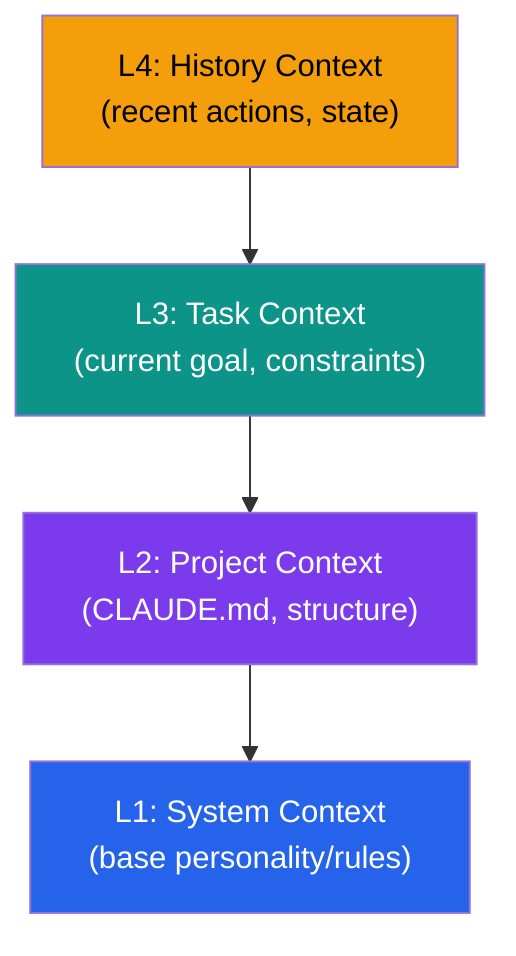

# SPINE Integration

Context engineering and MCP-native orchestration.

---

## Overview

SPINE (Software Project Intelligence & Navigation Engine) focuses on **context engineering**, **self-play validation**, and **intelligent multi-provider routing**.

---

## Key Differentiators

| Feature | What It Does |
|---------|--------------|
| **Multi-Provider Routing** | Routes tasks to optimal LLM |
| **6-Layer Context Stacks** | Constitution-based prompts |
| **DIALECTIC Self-Play** | Thesis/antithesis/synthesis |
| **Atomic Instrumentation** | ToolEnvelope wraps every call |
| **Oscillation Detection** | 3-pattern stuck detection |
| **Conflict Resolution** | 6-type contradiction handling |

---

## Context Stacks

SPINE manages context as layered stacks:

---

## DIALECTIC Methodology

Three phases per round:
1. **THESIS**: Generate proposal
2. **ANTITHESIS**: Challenge proposal
3. **SYNTHESIS**: Resolve conflicts

---

## Multi-Provider Routing

Route tasks to optimal LLM provider:

| Task Type | Provider |
|-----------|----------|
| PLANNING | Anthropic Claude |
| EXECUTION | OpenAI GPT |
| MULTIMODAL | Google Gemini |
| DISCOVERY | xAI Grok |

---

## Tiered Enforcement

| Tier | Description | Requirements |
|------|-------------|--------------|
| **1** | Simple, single-file | Direct execution OK |
| **2** | Multi-file, features | SHOULD use subagents |
| **3** | Architecture, research | MUST use subagents + MCP |

---

## Integration with 8me

| 8me Tier | SPINE Usage |
|----------|-------------|
| Tier 0 | None (pure learning) |
| Tier 1 | Circuit breaker patterns |
| Tier 2 | Skill integration, context loading |
| Tier 3 | MCP resources and tools |
| Tier 3.5 | DIALECTIC, oscillation detection |
| Tier 4 | Full Adaptive MCP Orchestrator |

---

## Next Steps

- Learn about [Minna Memory](../minna-memory/)
- See full documentation in [8me repository](https://github.com/fbratten/8me/tree/main/src/tier3.5-orchestration-concepts)

---

  <a href="../">← Back to Concepts</a>

